-- 1) -Без индекса
EXPLAIN (ANALYZE, BUFFERS)
SELECT * FROM cinema.purchase
WHERE price > 15;
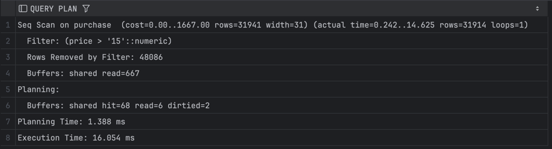

-B tree index
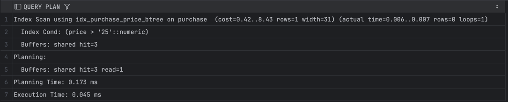

-Hash
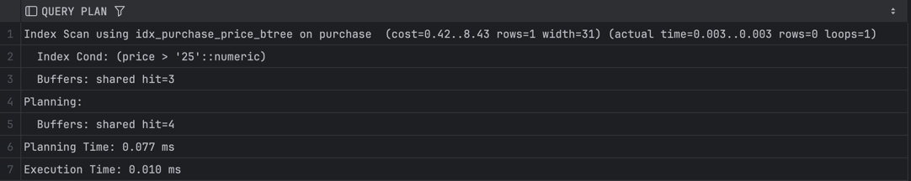

-- 2) Без индекса
EXPLAIN (ANALYZE, BUFFERS)
SELECT * FROM cinema.users
WHERE email = 'user50000@mail.com';
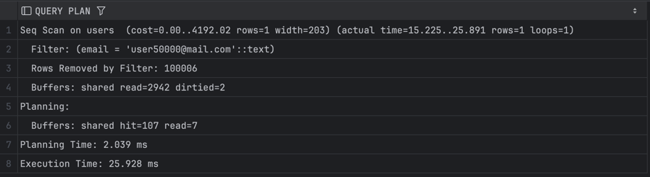

-B tree
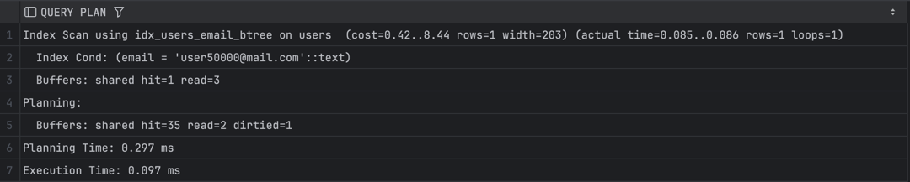

-Hash
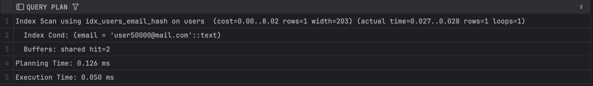

-- 3) Без индекса
EXPLAIN (ANALYZE, BUFFERS)
SELECT * FROM cinema.movie
WHERE description LIKE '%movie%';
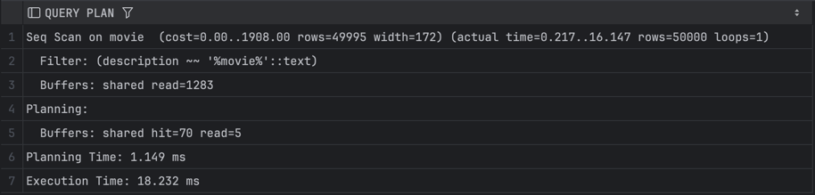
-B tree
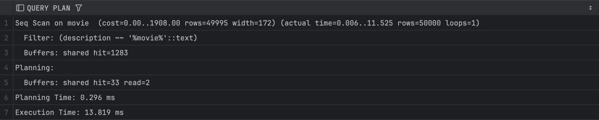

-Hash
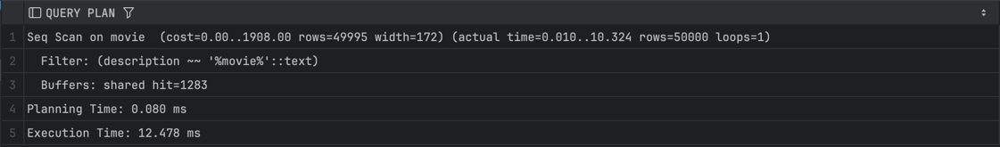

-- 4) Без индекса
EXPLAIN (ANALYZE, BUFFERS)
SELECT * FROM cinema.users
WHERE name LIKE 'Admin%';
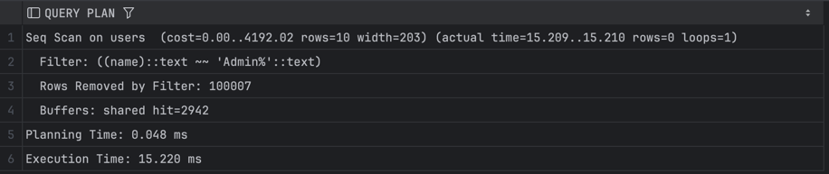

-B tree
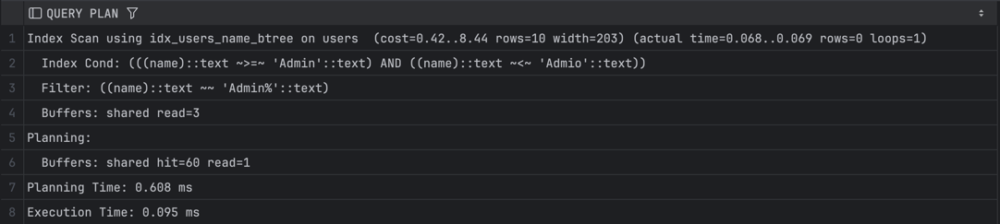

-Hash
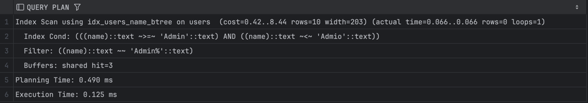

-- 5) Без индекса
EXPLAIN (ANALYZE, BUFFERS)
SELECT v.*, m.title
FROM cinema.viewing v
JOIN cinema.movie m ON v.movie_id = m.movie_id
WHERE m.movie_id IN (100, 1000, 5000, 10000, 25000);
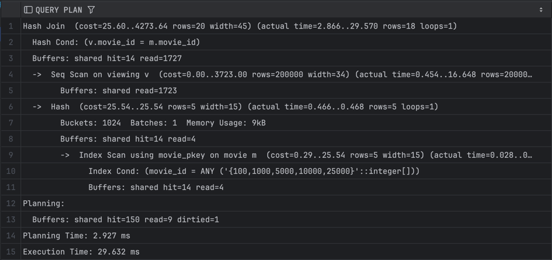

-B tree
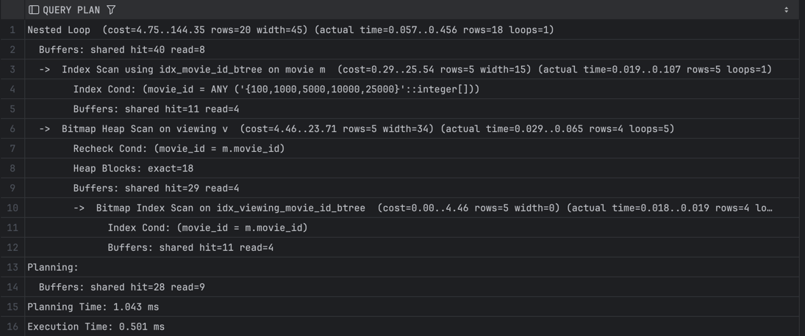

-Hash
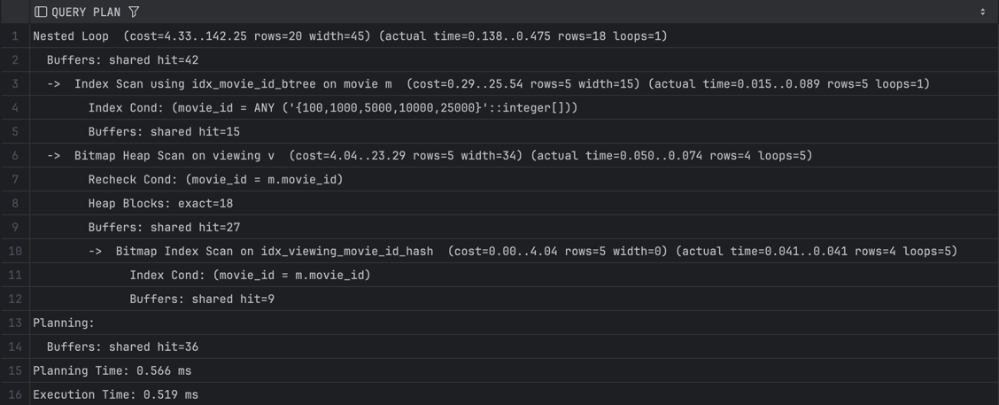