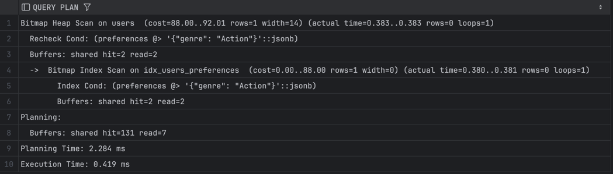
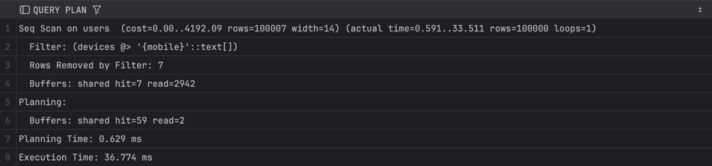
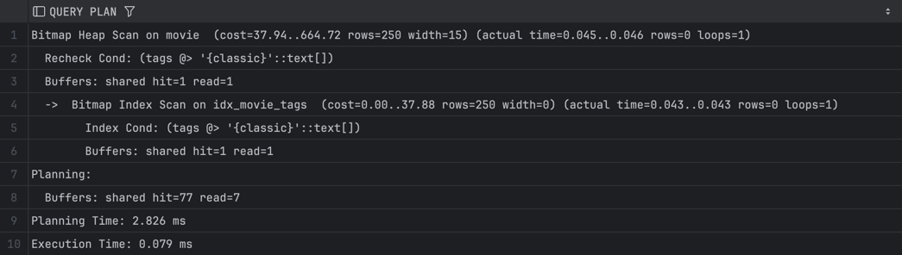
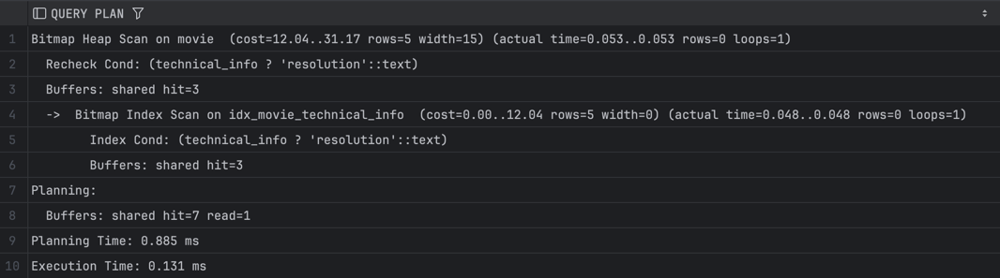
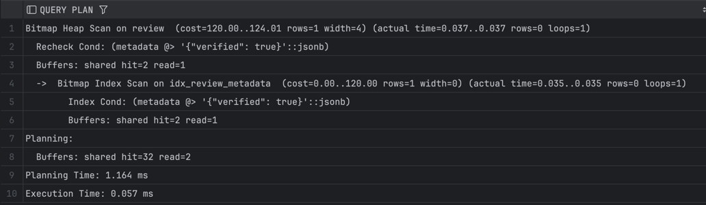
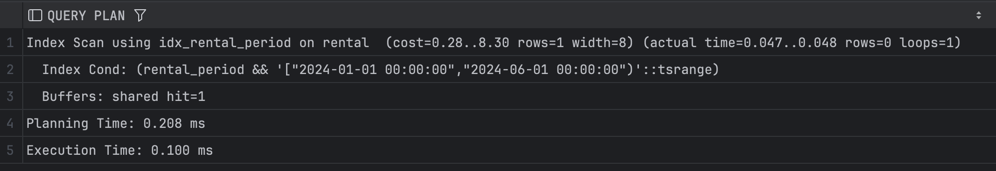
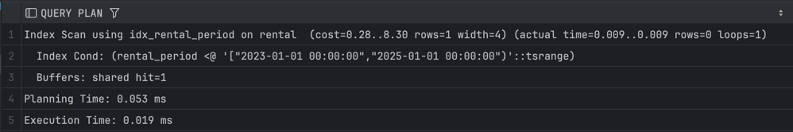
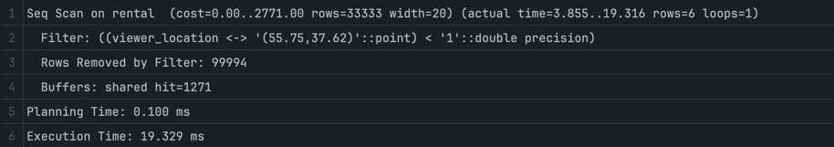
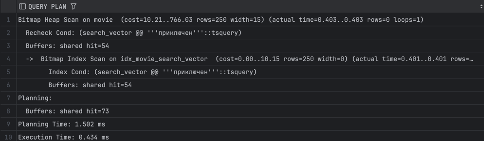
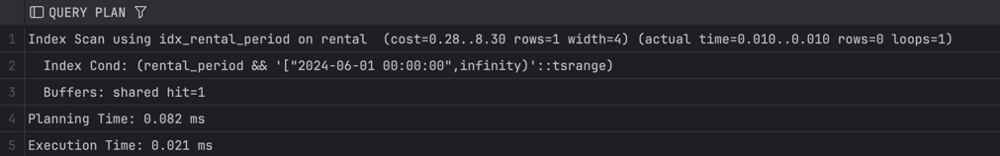

**-- GIN --**

1)EXPLAIN (ANALYZE, BUFFERS)
SELECT user_id, name
FROM cinema.users
WHERE preferences @> '{"genre": "Action"}';

2)EXPLAIN (ANALYZE, BUFFERS)
SELECT user_id, name
FROM cinema.users
WHERE devices @> ARRAY['mobile'];

3)EXPLAIN (ANALYZE, BUFFERS)
SELECT movie_id, title
FROM cinema.movie
WHERE tags @> ARRAY['classic'];

4)EXPLAIN (ANALYZE, BUFFERS)
SELECT movie_id, title
FROM cinema.movie
WHERE technical_info ? 'resolution';

5)EXPLAIN (ANALYZE, BUFFERS)
SELECT review_id
FROM cinema.review
WHERE metadata @> '{"verified": true}';

**-- GIST --**

1)EXPLAIN (ANALYZE, BUFFERS)
SELECT rental_id, user_id
FROM cinema.rental
WHERE rental_period && tsrange('2024-01-01', '2024-06-01');

2)EXPLAIN (ANALYZE, BUFFERS)
SELECT rental_id
FROM cinema.rental
WHERE rental_period <@ tsrange('2023-01-01', '2025-01-01');

3)EXPLAIN (ANALYZE, BUFFERS)
SELECT rental_id, viewer_location
FROM cinema.rental
WHERE viewer_location <-> point(55.75, 37.62) < 1;

4)EXPLAIN (ANALYZE, BUFFERS)
SELECT movie_id, title
FROM cinema.movie
WHERE search_vector @@ to_tsquery('russian', 'приключение');

5)EXPLAIN (ANALYZE, BUFFERS)
SELECT rental_id
FROM cinema.rental
WHERE rental_period && tsrange('2024-06-01', 'infinity');

все результаты сканирования join запросов в csv файлах в папке joins
