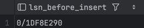
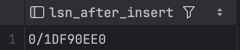
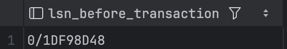
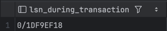
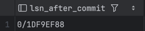
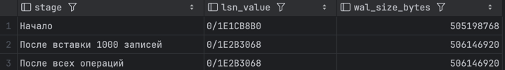
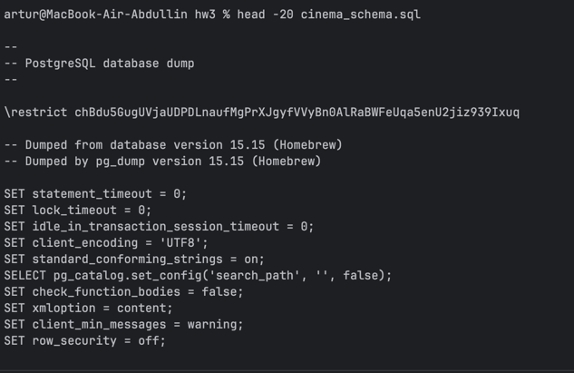
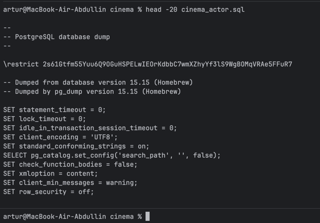

2a)LSN

--lsn до вставки

SELECT get_current_lsn() as lsn_before_insert;

--вставка 

INSERT INTO cinema.actor (name, birth_date, country, biography)
VALUES ('Леонардо ДиКаприо', '1974-11-11', 'США', 'Известный американский актер');

--lsn после вставки

SELECT get_current_lsn() as lsn_after_insert;

2b) WAL до и после коммита

BEGIN;

-- Смотрим текущую позицию в WAL

SELECT pg_current_wal_insert_lsn() as lsn_before_transaction;

-- Выполняем несколько операций

INSERT INTO cinema.movie (title, release_year, director_id)
VALUES ('Дюна', 2021, 1);

INSERT INTO cinema.movie_genre (movie_id, genre_id)
VALUES (30000, 1); 

-- Смотрим LSN внутри транзакции (до commit)

SELECT pg_current_wal_insert_lsn() as lsn_during_transaction;

COMMIT;

-- Смотрим LSN после commit

SELECT pg_current_wal_insert_lsn() as lsn_after_commit;

2с)

3a)

pg_dump -U artur -d cinema_db --schema-only > cinema_schema.sql - только схема

3b)

pg_dump -U artur -d cinema_db --table=cinema.actor > cinema_actor.sql

