Physical streaming replication

-- Архитектура:

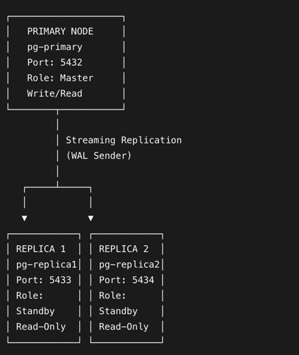

-- Поднятые инстансы:
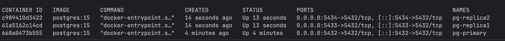

docker exec -it pg-primary psql -U admin -d cinema_db - подключение к primary

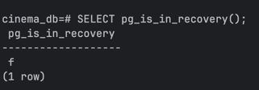

На primary выполняем запросы:
-- Создать тестовую таблицу на primary
CREATE TABLE replication_test (
id SERIAL PRIMARY KEY,
message TEXT NOT NULL
);

INSERT INTO replication_test (message)
VALUES ('hello from primary');

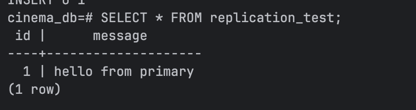

docker exec -it pg-replica1 psql -U postgres -d cinema_db - подключение к replica1

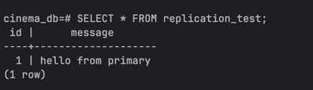

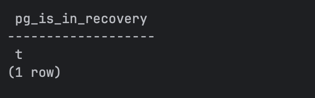

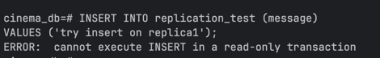

docker exec pg-replica2 psql -U postgres -d cinema_db  - подключение к replica2

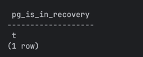

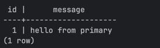

-- Анализ Replication Lag

docker exec -it pg-primary psql -U postgres -d cinema_db

SELECT application_name,
state,
sync_state,
write_lag,
flush_lag,
replay_lag,
pg_wal_lsn_diff(pg_current_wal_lsn(), replay_lsn) AS byte_lag
FROM pg_stat_replication;

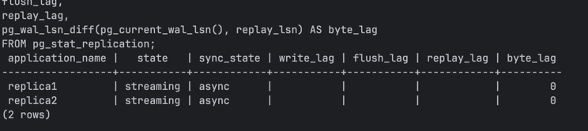

-- Нагрузка на primary (300_000 строк)
CREATE TABLE IF NOT EXISTS load_test (
id SERIAL PRIMARY KEY,
payload TEXT NOT NULL,
created_at TIMESTAMP DEFAULT now()
);

INSERT INTO load_test (payload)
SELECT repeat(md5(random()::text), 20)
FROM generate_series(1, 300000);

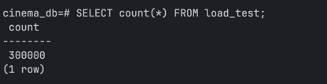

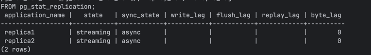

данные на реплики дошли 

Logical Replication

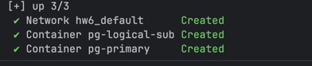

docker exec -it pg-primary bash - разрешаем подключение в pg_hba.conf на publisher

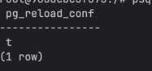

docker exec -it pg-primary psql -U postgres -d cinema_db - создаем на publisher таблицы и publication

CREATE TABLE logical_test (
id INT PRIMARY KEY,
message TEXT NOT NULL
);

CREATE PUBLICATION demo_pub FOR TABLE logical_test;

docker exec -it pg-logical-sub psql -U postgres -d cinema_db - подключение к subscriber

CREATE TABLE logical_test (
id INT PRIMARY KEY,
message TEXT NOT NULL
); - создаем на subscriber таблицу

docker exec -it pg-logical-sub psql -U postgres -d cinema_db - создаем subscription

CREATE SUBSCRIPTION demo_sub
CONNECTION 'host=primary port=5432 dbname=cinema_db user=postgres password=postgres'
PUBLICATION demo_pub;

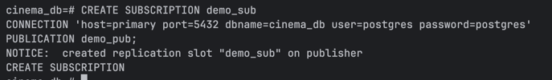

docker exec -it pg-primary psql -U postgres -d cinema_db - вставляем данные на publisher

INSERT INTO logical_test (id, message)
VALUES (1, 'hello logical replication');

SELECT * FROM logical_test;

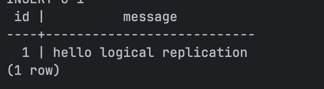

docker exec -it pg-logical-sub psql -U postgres -d cinema_db - проверяем данные на subscriber

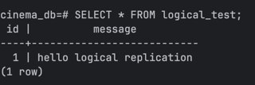

-- DDL не реплицируется, проверяем

docker exec -it pg-primary psql -U postgres -d cinema_db

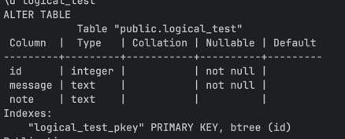

docker exec -it pg-logical-sub psql -U postgres -d cinema_db - проверяем структуру таблицы на subscriber

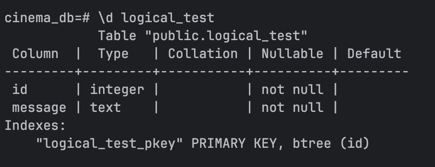

--Проверка REPLICA IDENTITY

docker exec -it pg-primary psql -U postgres -d cinema_db - Таблица без PK на publisher

CREATE TABLE no_pk_test (
a INT,
b TEXT
);

ALTER PUBLICATION demo_pub ADD TABLE no_pk_test;

docker exec -it pg-logical-sub psql -U postgres -d cinema_db

CREATE TABLE no_pk_test (
a INT,
b TEXT
);

docker exec -it pg-primary psql -U postgres -d cinema_db - insert работает на publisher

INSERT INTO no_pk_test (a, b) VALUES (1, 'first');
SELECT * FROM no_pk_test;

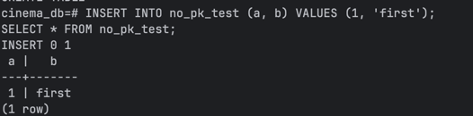

docker exec -it pg-logical-sub psql -U postgres -d cinema_db

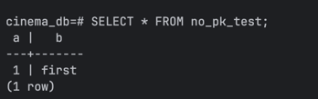

docker exec -it pg-primary psql -U postgres -d cinema_db

UPDATE no_pk_test
SET b = 'updated'
WHERE a = 1; - ошибка, нет replica identity

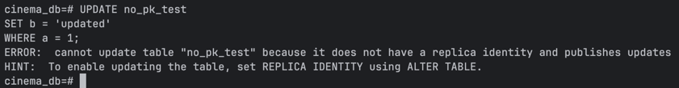

Чтобы это исправить, на publisher и subscriber можно выставить:
ALTER TABLE no_pk_test REPLICA IDENTITY FULL;

-- Проверка replication status

docker exec -it pg-logical-sub psql -U admin -d cinema_db

SELECT subname,
pid,
relid::regclass,
received_lsn,
latest_end_lsn,
latest_end_time
FROM pg_stat_subscription;

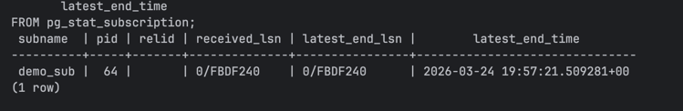

-- Как пригодятся pg_dump / pg_restore

Logical replication не реплицирует DDL и схему, поэтому pg_dump --schema-only удобен, чтобы быстро создать на subscriber совместимую схему до создания subscription.

