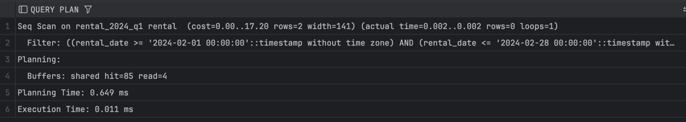
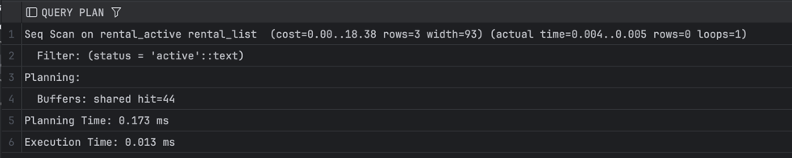
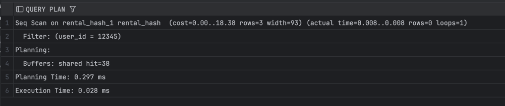

1) Секционирование

Range:

EXPLAIN (ANALYZE, BUFFERS)
SELECT * FROM cinema.rental
WHERE rental_date BETWEEN '2024-02-01' AND '2024-02-28';

Ответы:

-- a) partition pruning используется

-- b) 1 (только rental_2024_q1)

-- c) idx_rental_2024_q1_user_id если запрос по user_id

List:

EXPLAIN (ANALYZE, BUFFERS)
SELECT * FROM cinema.rental_list WHERE status = 'active';

Ответы:

-- a) partirion pruning
-- b) 1 (rental_active)
-- c) нет, если нет индекса на партиции

Hash:

EXPLAIN (ANALYZE, BUFFERS)
SELECT * FROM cinema.rental_hash WHERE user_id = 12345;

Ответы:
-- a) partition pruning
-- b) 1 (только одна хэш-партиция)
-- c) нет, если нет индекса на партиции