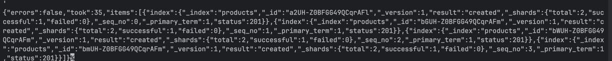
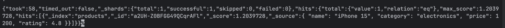
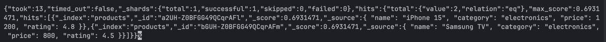
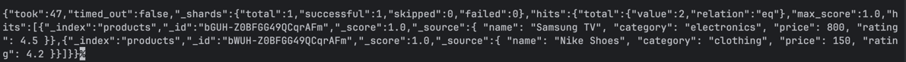
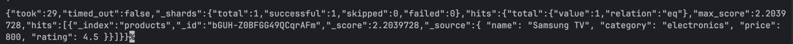

curl -X PUT "localhost:9200/products" -H 'Content-Type: application/json' -d'
{
"mappings": {
"properties": {
"name": { "type": "text" },
"category": { "type": "keyword" },
"price": { "type": "float" },
"rating": { "type": "float" }
}
}
}
'

curl -X POST "localhost:9200/products/_bulk" -H 'Content-Type: application/json' -d'
{ "index": {} }
{ "name": "iPhone 15", "category": "electronics", "price": 1200, "rating": 4.8 }
{ "index": {} }
{ "name": "Samsung TV", "category": "electronics", "price": 800, "rating": 4.5 }
{ "index": {} }
{ "name": "Nike Shoes", "category": "clothing", "price": 150, "rating": 4.2 }
{ "index": {} }
{ "name": "Cooking Book", "category": "books", "price": 30, "rating": 4.7 }
'

curl -X GET "localhost:9200/products/_search" -H 'Content-Type: application/json' -d'
{
"query": {
"match": {
"name": "iphone"
}
}
}
'

curl -X GET "localhost:9200/products/_search" -H 'Content-Type: application/json' -d'
{
"query": {
"term": {
"category": "electronics"
}
}
}
'

curl -X GET "localhost:9200/products/_search" -H 'Content-Type: application/json' -d'
{
"query": {
"range": {
"price": {
"gte": 100,
"lte": 1000
}
}
}
}
'

curl -X GET "localhost:9200/products/_search" -H 'Content-Type: application/json' -d'
{
"query": {
"bool": {
"must": [
{ "match": { "name": "tv" } }
],
"filter": [
{ "term": { "category": "electronics" } }
],
"should": [
{ "range": { "rating": { "gte": 4.5 } } }
]
}
}
}
'

