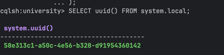
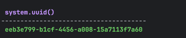
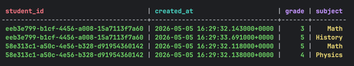
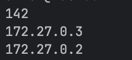
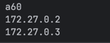
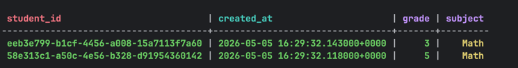

CREATE KEYSPACE university
WITH replication = {
'class': 'SimpleStrategy',
'replication_factor': 2
};

USE university;

CREATE TABLE student_grades (
student_id uuid,
created_at timestamp,
subject text,
grade int,
PRIMARY KEY (student_id, created_at)
);

SELECT uuid() FROM system.local;
SELECT uuid() FROM system.local;

INSERT INTO student_grades (student_id, created_at, subject, grade)
VALUES (58e313c1-a50c-4e56-b328-d91954360142, toTimestamp(now()), 'Math', 5);

INSERT INTO student_grades (student_id, created_at, subject, grade)
VALUES (58e313c1-a50c-4e56-b328-d91954360142, toTimestamp(now()), 'Physics', 4);

INSERT INTO student_grades (student_id, created_at, subject, grade)
VALUES ( eeb3e799-b1cf-4456-a008-15a7113f7a60
, toTimestamp(now()), 'Math', 3);

INSERT INTO student_grades (student_id, created_at, subject, grade)
VALUES ( eeb3e799-b1cf-4456-a008-15a7113f7a60
, toTimestamp(now()), 'History', 5);

docker exec -it cassandra-node1 nodetool getendpoints university student_grades 58e313c1-a50c-4e56-b328-d91954360

docker exec -it cassandra-node1 nodetool getendpoints university student_grades eeb3e799-b1cf-4456-a008-15a7113f7

SELECT * FROM student_grades WHERE subject = 'Math' ALLOW FILTERING;

