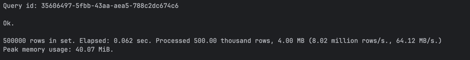
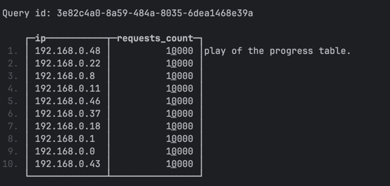
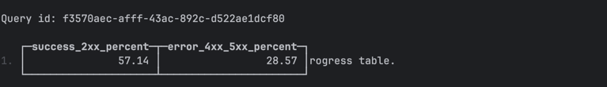
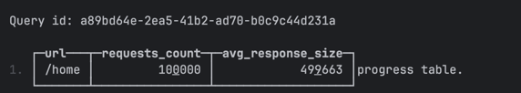
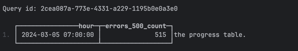

CREATE TABLE web_logs (
log_time DateTime,
ip String,
url String,
status_code UInt16,
response_size UInt64
) ENGINE = MergeTree()
ORDER BY (log_time, status_code);

INSERT INTO web_logs
SELECT
toDateTime('2024-03-01 00:00:00') + INTERVAL number SECOND,
concat('192.168.0.', toString(number % 50)),
arrayElement(['/home', '/api/users', '/api/orders', '/admin', '/products'], number % 5 + 1),
arrayElement([200, 200, 200, 404, 500, 301, 200], number % 7 + 1),
rand() % 1000000
FROM numbers(500000);

1. Top 10 по количеству запросов

SELECT
ip,
count(*) AS requests_count
FROM web_logs
GROUP BY ip
ORDER BY requests_count DESC
LIMIT 10;

2. Процент успешных и ошибочных запросов

SELECT
round(countIf(status_code >= 200 AND status_code < 300) / count() * 100, 2) AS success_2xx_percent,
round(countIf(status_code >= 400 AND status_code < 600) / count() * 100, 2) AS error_4xx_5xx_percent
FROM web_logs;

3. Самый популярный URL и средний размер ответа

SELECT
url,
count(*) AS requests_count,
round(avg(response_size), 2) AS avg_response_size
FROM web_logs
GROUP BY url
ORDER BY requests_count DESC
LIMIT 1;

4. Час с наибольшим количеством ошибок 500

SELECT
toStartOfHour(log_time) AS hour,
count(*) AS errors_500_count
FROM web_logs
WHERE status_code = 500
GROUP BY hour
ORDER BY errors_500_count DESC
LIMIT 1;

