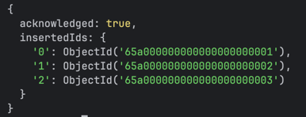
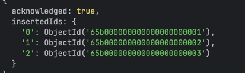
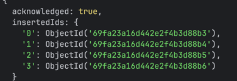
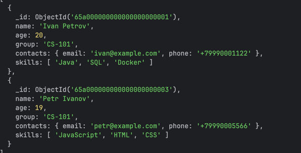
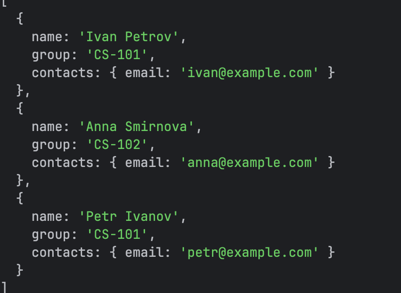
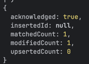
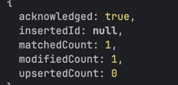

docker exec -it mongodb-lab mongosh -u admin -p admin123

use university

db.students.insertMany([
{
_id: ObjectId("65a000000000000000000001"),
name: "Ivan Petrov",
age: 20,
group: "CS-101",
contacts: {
email: "ivan@example.com",
phone: "+79990001122"
},
skills: ["Java", "SQL", "Docker"]
},
{
_id: ObjectId("65a000000000000000000002"),
name: "Anna Smirnova",
age: 21,
group: "CS-102",
contacts: {
email: "anna@example.com",
phone: "+79990003344"
},
skills: ["Python", "MongoDB", "Linux"]
},
{
_id: ObjectId("65a000000000000000000003"),
name: "Petr Ivanov",
age: 19,
group: "CS-101",
contacts: {
email: "petr@example.com",
phone: "+79990005566"
},
skills: ["JavaScript", "HTML", "CSS"]
}
])

db.courses.insertMany([
{
_id: ObjectId("65b000000000000000000001"),
title: "Databases",
teacher: "Dr. Sokolov",
credits: 5
},
{
_id: ObjectId("65b000000000000000000002"),
title: "Backend Development",
teacher: "Dr. Orlov",
credits: 4
},
{
_id: ObjectId("65b000000000000000000003"),
title: "DevOps Basics",
teacher: "Dr. Kuznetsov",
credits: 3
}
])

db.enrollments.insertMany([
{
student_id: ObjectId("65a000000000000000000001"),
course_id: ObjectId("65b000000000000000000001"),
semester: "Spring 2026",
grade: 5
},
{
student_id: ObjectId("65a000000000000000000001"),
course_id: ObjectId("65b000000000000000000002"),
semester: "Spring 2026",
grade: 4
},
{
student_id: ObjectId("65a000000000000000000002"),
course_id: ObjectId("65b000000000000000000001"),
semester: "Spring 2026",
grade: 5
},
{
student_id: ObjectId("65a000000000000000000003"),
course_id: ObjectId("65b000000000000000000003"),
semester: "Spring 2026",
grade: 3
}
])

Запрос 1 — найти студентов группы CS-101

db.students.find({
group: "CS-101"
})

Запрос 2 — с projection
Показать только имя, группу и email, скрыть _id:

db.students.find(
{},
{
_id: 0,
name: 1,
group: 1,
"contacts.email": 1
}
)

Update 1 — изменить возраст студента

db.students.updateOne(
{ name: "Ivan Petrov" },
{ $set: { age: 21 } }
)

Update 2 — добавить новый skill в массив

db.students.updateOne(
{ name: "Anna Smirnova" },
{ $push: { skills: "Kubernetes" } }
)

Aggregate-запрос
Средняя оценка по каждому курсу:

db.enrollments.aggregate([
{
$group: {
_id: "$course_id",
avg_grade: { $avg: "$grade" },
students_count: { $sum: 1 }
}
},
{
$lookup: {
from: "courses",
localField: "_id",
foreignField: "_id",
as: "course"
}
},
{
$unwind: "$course"
},
{
$project: {
_id: 0,
course_title: "$course.title",
avg_grade: 1,
students_count: 1
}
}
])

