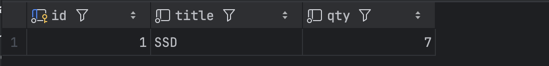

**ЗАДАНИЕ 1**

1)
EXPLAIN SELECT id, user_id, amount, created_at
FROM exam_events
WHERE user_id = 4242
AND created_at >= TIMESTAMP '2025-03-10 00:00:00'
AND created_at < TIMESTAMP '2025-03-11 00:00:00';
2)
- Seq Scan
- idx_exam_events_status, idx_exam_events_amount_has
- Нет индексов, самый оптимальный
3) CREATE INDEX idx_exam_events_range ON exam_events(created_at);
5) Используется Bitmap Heap Scan так как есть индекс на поле created_at
6) Не нужно планировщик видит созданный индекс

**ЗАДАНИЕ 2**
2) Hash Join 
3) Потому что сравнение по u.country в небольшом диапазоне и выборка из небольой таблицы
4) Полезны - idx_exam_orders_created_at Бесползены - idx_exam_users_name
5) Новый индекс на таблице users по полю country
7) Cost уменьшился но незначительно
8) shared hit - чтение из буфера

**ЗАДАНИЕ 3**

1) xmin - увеличился
xmax - без изменений
2) Конкурентный доступ и изоляция транзакций
3) После удаление данные не удаляются окончательно, строка физически существует но по логике "удалена"
4) Vacuum - ручное удаление строк, autovacuum - автоматическое + Vacuum Analize, vacuum full - удаление + блокировка всех таблиц
5) Vacuum full - полное блокирование таблицы

**ЗАДАНИЕ 4**

